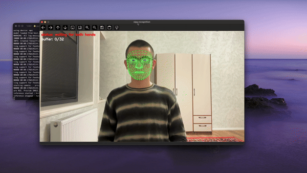
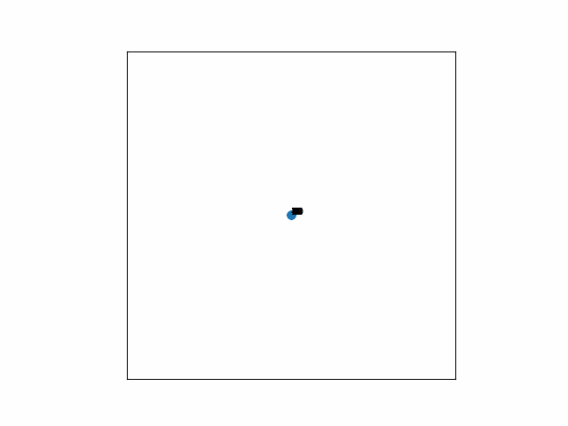
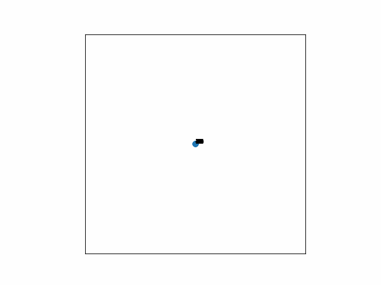
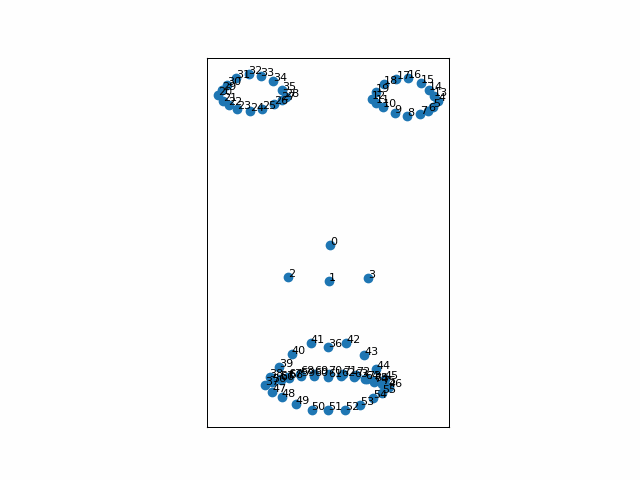
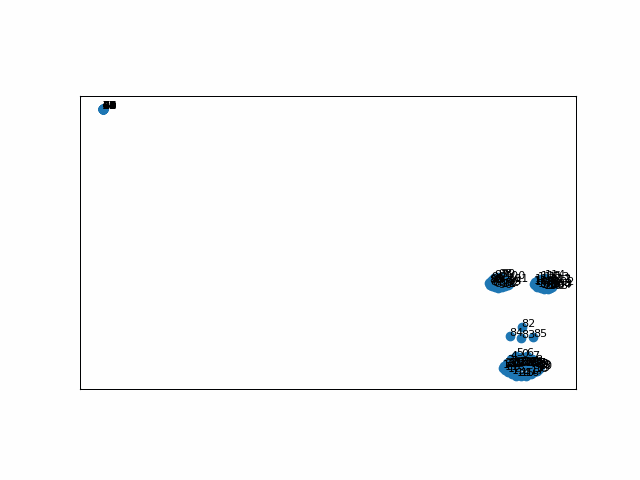
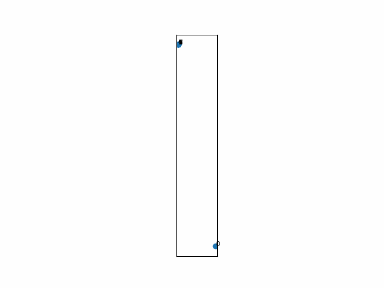
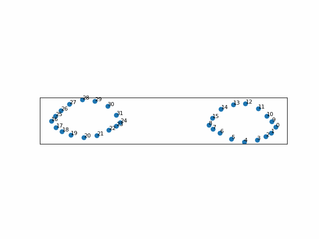
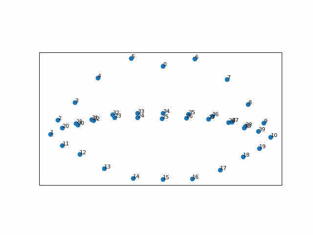
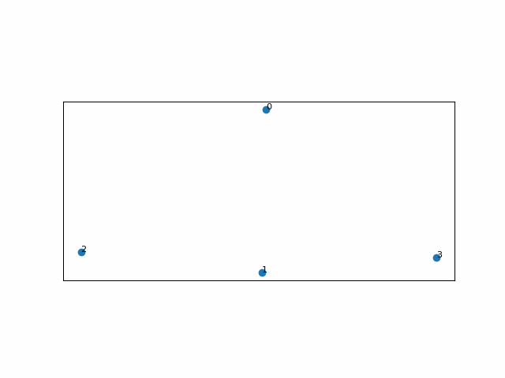

# Uzbek Sign Language Recognition (UzSLR)

> **Quick Start:**  
> If you want to run the **inferencing** process locally without reading through the entire documentation, watch this **[Video Tutorial for Inferencing](https://youtu.be/CV5R3Xx14So)** to get started right away.  
>  
> For those interested in **video collection** and understanding the full pipeline, watch this **[Video Tutorial for Video Collection](https://youtu.be/3A1UdCw6Yj4)**.
>
> **Folder Tree:**   
> To correctly place the dataset within the project, see[`FOLDER_TREE.md`](FOLDER_TREE.md)


<p align="center">
  
</p>

This repository aims to develop a **machine learning model for recognizing isolated dynamic Uzbek Sign Language (UzSL)** from video data.  

To achieve this, the repository provides a **full pipeline** that includes:

| # | Pipeline Stage | Conda Environment |
|---|---------------|-------------------|
| 1 | **Video Collection** ([`video-collector`](./video-collector/)) | [`video_collector_env`](./video-collector/environment-video-collector.yml) |
| 2 | **Dataset Preparation** ([`dataset-prep`](./dataset-prep/)) | [`video_collector_env`](./video-collector/environment-video-collector.yml) |
| 3 | **Data Preprocessing** ([`preprocessing`](./preprocessing/)) | [`uzslr-signs`](./environment-uzslr-signs.yml) |
| 4 | **Model Training and Evaluation** ([`modeling`](./modeling/)) | [`uzslr-signs`](./environment-uzslr-signs.yml) |
| 5 | **Real-Time Inferencing** ([`inferencing`](./inferencing/)) | [`uzslr-signs`](./environment-uzslr-signs.yml) |
| 6 | **Web-App Inferencing** ([`web_app`](./web_app/)) | [`web-uzslr-signs`](./web_app/environment-web-uzslr-signs.yml) |


> Note: `video-collector` and `dataset-prep` are foundational steps — they generate a clean, structured dataset that the model will later use.

---

## Python version
`3.9.23`

## Conda Environments

Anaconda: `conda 24.11.3`

To ensure reproducibility, we use a dedicated environment for `video-collector` and `dataset-prep`:

```bash
# Change directory to where "environment-video-collector.yml" is located
cd ./video-collector

# Create and activate the environment
conda env create -f environment-video-collector.yml
conda activate video_collector_env
```
> [!TIP]
> This environment should be active for all scripts in `video-collector` and `dataset-prep`.
>
> The `preprocessing`, `modeling` and `inferencing` steps use their own dedicated conda environment [`uzslr-signs`](./environment-uzslr-signs.yml) to isolate dependencies.

---

> [!NOTE]
> All detailed references, instructions, and links are included in the `README` files of each individual step.  
> This main `README` provides only a **high-level overview** of the full pipeline.

## Phase 1: Video Collection ([`video-collector`](./video-collector/))

**Purpose:** Record signers performing signs and extract per-frame MediaPipe landmarks.

### Key Features:
- Supports multiple signers and sign words.
- Multiple repetitions per sign.
- Real-time feedback (countdown, rep count, CLI tree view).
- Automatic folder and file management.

### Output Dataset Structure
<pre>
.
└─ video-collector/Data_Numpy_Arrays_RSL_UzSL/
    └─ signerXX/
      └─ sign_name/
          ├─ landmarks/rep-XX/frame-XX.npy
          └─ videos/rep-XX/video.mp4
</pre>

### Run Video Collection

```shell
cd ./video-collector
python mod05_main.py
```
> After recording, run dataset checks in [`video-collector/dataset-checks/`](./video-collector/dataset-checks/) to ensure integrity.

> [!TIP]
> For the full understanding of how to run or modify `video-collector` and `video-collector/dataset-checks/`, it is **strongly advised to read** [`video-collector/README.md`](./video-collector/README.md)

### Video Tutorial for Video Collection

To learn how to collect video data and set up the environment for recording locally, follow this tutorial:

**[Video Tutorial for Video Collection](https://youtu.be/3A1UdCw6Yj4)**

The video covers:
- How to set up and run video collection for both Unix-like systems and Windows.
- Step-by-step guidance to collect the necessary data for training the model.
- Configurations and Troubleshooting.

<details>
<summary><b>To see commands, click here:</b></summary>

### Unix-like system
Steps:
1. 

```shell
git clone https://github.com/00015775/uzslr-isolated-dynamic.git
```

2. 
```shell
cd uzslr-isolated-dynamic
```
3. 
```shell
cd ./video-collector
```
4.
```shell 
conda env create -f environment-video-collector.yml
```
5. 
```shell
conda activate video_collector_env
```
6. 
```shell
python mod05_main.py
```

### Windows
Steps:
1. 
```shell
git clone https://github.com/00015775/uzslr-isolated-dynamic.git
```
2. 
```shell
Set-Location -Path .\uzslr-isolated-dynamic
```
3. 
```shell
Set-Location .\video-collector
```
4. 
```shell
conda env create -f environment-video-collector.yml
```
5.
```shell 
conda activate video_collector_env
```
6. 
```shell
python mod05_main.py
```

</details>


---

## Phase 2: Dataset Preparation ([`dataset-prep`](./dataset-prep/))

**Purpose:** Reorganize raw landmarks for model training and split dataset into train/validation/test sets.

### Key Steps:
- Copy landmarks into `/data/` (pre-split dataset).
- Validate frame counts and repetitions.
- Split dataset into train (80%), validation (10%), and test (10%) sets.
- Verify dataset splits.

### Post-Splitting Dataset Structure
<pre>
.
└─ data/
    ├─ train/{sign_name}/rep-{XX}/frame-{XX}.npy
    ├─ validation/{sign_name}/rep-{XX}/frame-{XX}.npy
    └─ test/{sign_name}/rep-{XX}/frame-{XX}.npy
</pre>

### Run Dataset Preparation

> [!CAUTION]
> Please read **[`dataset-prep/README.md`](./dataset-prep/README.md) carefully before running these scripts.**  
> These scripts modify **GB-sized datasets** and may accidentally overwrite or delete your dataset.

```shell
# Assuming that you are at the root directory of the repository

# Move to the dataset preparation directory
cd ./dataset-prep
python step01_reorganize_dataset.py

# Go to dataset integrity check scripts (before splitting)
cd ./dataset-checks
python 01_check_frames.py
python 02_count_repetitions.py

# Return to dataset-prep to perform train/val/test split
cd ..
python step02_train_val_test_split.py

# Re-enter dataset-checks for post-split validation
cd ./dataset-checks
python 03_verify_dataset_splits.py
python 04_check_frames_after_dataset_splits.py
```

---

## Phase 3: Data Preprocessing ([`preprocessing`](./preprocessing/))

> **Note:** The preprocessing pipeline was logically adapted from Sohn, H. (2023). See **Acknowledgements** section at the bottom.

**Purpose:** Prepare landmark sequences for model training by selecting relevant features, normalizing, and augmenting the data.  

### Key Steps:
- **Feature Selection:** Uses 118 key landmarks (hands, lips, eyes, nose) out of 543.  
- **Preprocessing:** Centering, normalization, and temporal feature extraction (velocity + acceleration).  
- **Augmentation:** Random temporal resampling, horizontal flip, spatial affine transforms, cropping, and masking.  
- **Dataset Class:** `SignDataset` handles loading `.npy` frames, applying augmentations, and generating fixed-length sequences (`MAX_LEN = 32`).  
- **Output:** Each sample has shape `(T, 708)` and batches have shape `(B, T, 708)` for PyTorch models.  

### Conda Environment
```shell
# create and activate the environment (shared with modeling and inferencing)
conda env create -f environment-uzslr-signs.yml
conda activate uzslr-signs
```

> [!TIP] 
> Full details, rationale, and step-by-step explanation can be found in [`preprocessing/README.md`](./preprocessing/README.md)


> [!IMPORTANT]
> While `video-collector` and `dataset-prep` use their own dedicated environment ([`environment-video-collector.yml`](./video-collector/environment-video-collector.yml)),  
> the [`preprocessing`](./preprocessing/), [`modeling`](./modeling/) and [`inferencing`](./inferencing/) steps use a single separate environment called [`uzslr-signs`](./environment-uzslr-signs.yml).  

<div align="center">
<table>
  <tr>
    <td align="center">
      <br>
      Right Hand
    </td>
    <td align="center">
      <br>
      Left Hand
    </td>
    <td align="center">
      <br>
      Both Hands
    </td>
  </tr>

  <tr>
    <td align="center">
      <br>
      Face
    </td>
    <td align="center">
      <br>
      Full Body
    </td>
    <td align="center">
    <br>
      Pose (<i>not used</i>)
    </td> 
  </tr>

  <tr>
    <td align="center">
      <br>
      Eyes
    </td>
    <td align="center">
      <br>
      Lips
    </td>
    <td align="center">
      <br>
      Nose
    </td>
  </tr>
</table>
</div>


---


## Phase 4: Model Training and Evaluation ([`modeling`](./modeling/))

> **Note:** The modeling pipeline was logically adapted from Sohn, H. (2023). See **Acknowledgements** section at the bottom.

**Purpose:** Train and evaluate a hybrid CNN-Transformer model for recognizing 50 Uzbek sign language classes.

### Key Features:
- **Hybrid architecture:** Combines causal convolutions with transformer blocks for temporal modeling.
- **Input/Output:** Takes preprocessed landmarks `(batch, 32, 708)` and outputs logits `(batch, 50)`.
- **Training:** AdamW optimizer with early stopping, achieves ~92% validation accuracy and ~87% test accuracy.
- **Model sizes:** Base model (dim=192) and large model (dim=384).

### Conda Environment
```shell
conda activate uzslr-signs
```

> [!NOTE]
> The `uzslr-signs` environment is used across **preprocessing**, **modeling**, and **inferencing** for consistency.

### Video Tutorial for Inferencing

If you're unsure how to set up and run the inferencing locally, check out this step-by-step video tutorial:

**[Video Tutorial for Inferencing](https://youtu.be/CV5R3Xx14So)**

The tutorial covers:
- How to set up the environment for both Unix-like systems and Windows.
- Running inference with real-time recognition.

<details>
<summary><b>To see commands, click here:</b></summary>

### Unix-like system
Steps:
1. 
```shell
git clone https://github.com/00015775/uzslr-isolated-dynamic.git
```
2. 
```shell
cd uzslr-isolated-dynamic
```
3. 
```shell
conda env create -f environment-uzslr-signs.yml
```
4. 
```shell
conda activate uzslr-signs
```
5. 
```shell
cd ./inferencing
```
6. 
```shell
python inference04_main.py
```

### Windows
Steps:
1. 
```shell
git clone https://github.com/00015775/uzslr-isolated-dynamic.git
```
2. 
```shell
Set-Location -Path .\uzslr-isolated-dynamic
```
3. 
```shell
conda env create -f environment-uzslr-signs.yml
```
4. 
```shell
conda activate uzslr-signs
```
5. 
```shell
Set-Location -Path .\inferencing
```
6. 
```shell
python inference04_main.py
```

</details>

### Run Training

Training is performed in Jupyter notebooks with experimentations (_around 30 minutes with MPS acceleration_):

```shell
cd ./modeling/notebooks
jupyter notebook 03_ak_model_dev_v1.ipynb
```

### Model Outputs
- `best_model.pth`: model with best validation accuracy
- `checkpoint.pth`: latest training checkpoint for resuming

> [!TIP]
> For architecture details, feature engineering, and training configuration, see [`modeling/README.md`](./modeling/README.md)

---

## Phase 5: Real-Time Inference ([`inferencing`](./inferencing/))

**Purpose:** Deploy the trained model for real-time sign language recognition using a webcam.

### Key Features:
- Real-time inference with automatic hand detection
- No manual triggering required (hands-free operation)
- Displays predicted sign with confidence score
- Cross-platform support (MPS/CUDA/CPU)

### Run Inference

```shell
cd ./inferencing
python inference04_main.py
```

> [!TIP]
> For setup instructions and troubleshooting, see [`inferencing/README.md`](./inferencing/README.md)

---

## Phase 6: Web Application Deployment ([`web_app`](./web_app/))

**Purpose:** Deploy a real-time web application for recognizing 50 isolated Uzbek signs via webcam. Optionally, the app can form Uzbek sentences using a locally running language model (LLM mode).

> Docker Image: https://hub.docker.com/repository/docker/00015775/uzslr-web

> [!TIP]
> Check [DockerHub](https://hub.docker.com/repository/docker/00015775/uzslr-web) for the full list of available tags.

### Key Features:

- **Real-time recognition** of 50 Uzbek signs via webcam
- **MediaPipe Holistic** landmark extraction running entirely in the browser
- **PyTorch model** for sign classification
- **50 Signs gallery** with reference GIFs for every sign, searchable and with fullscreen view
- **LLM Mode** *(optional)* — collects signs and forms Uzbek sentences using [alloma-3b-q4](https://ollama.com/kmamaroziqov/alloma-3b-q4) and [alloma-1b-q4](https://ollama.com/kmamaroziqov/alloma-1b-q4) running locally via Ollama
- Fully **offline** after first load — no external API calls, no data sent anywhere


### Without LLM (sign recognition only)

```bash
docker pull 00015775/uzslr-web:1.0.0 
docker run -p 7860:7860 00015775/uzslr-web:1.0.0 
```

Open [http://localhost:7860](http://localhost:7860)

### With LLM (sign recognition + sentence formation)

```bash
docker pull 00015775/uzslr-web:2.0.0 

# on cpu
docker run -p 7860:7860 00015775/uzslr-web:2.0.0 

# on gpu
docker run --gpus all -p 7860:7860 00015775/uzslr-web:2.0.0 
```

Open [http://localhost:7860](http://localhost:7860) — the **LLM Mode** toggle will be visible in the right panel.

> [!TIP]
> For more local or docker setup instructions, see [`web_app/README.md`](./web_app/README.md)


---

## Dataset Preview: 50 Uzbek Sign Language Signs

This folder includes a visual preview of all **50 Uzbek Sign Language (UzSL) signs** supported by the model.

The preview is provided so that users can:
- Understand how each sign is performed
- Perform the same sign themselves during real-time inference
- Qualitatively verify that the model works as intended

The preview is located in [`show-50-signs/`](./show-50-signs/) and is organized as:

<pre>
show-50-signs/
├── README.md
└── signs/
    └── sign_name/
        ├── rep_000.gif
        └── rep_001.gif
</pre>

Each sign contains **two repetitions**, rendered as **animated GIFs** from MediaPipe Holistic landmarks.

For **privacy and ethical considerations**, the individuals from *School No. 101* are **not shown in these GIF previews**.  
All visual demonstrations in `show-50-signs/` were performed exclusively by the **author of this project**.

> Note: These GIFs are for visualization and user reference only.  
> The model is trained exclusively on `.npy` landmark sequences generated during the data collection and preprocessing stages.


---


## Publication (_upcoming: docs on `GitHub wiki` and paper in `LaTeX`_)

This phase will focus on documenting and analyzing the results of the project. The aim is to contribute to the broader sign language recognition and low-resource language research communities.


---

## Acknowledgements

The preprocessing and modeling pipelines in this project are **logical adaptations** of the work by **Sohn, H. (2023)**, specifically the *Hoyso48* training notebook.  

- This project **does not directly copy** the original code.  
- The original notebook was implemented in **TensorFlow** and used a different dataset structure.  
- In this repository, the pipelines have been **adapted to PyTorch** and modified to work with a **low-resource Uzbek Sign Language dataset**, including changes in folder organization and preprocessing steps.  

Reference and original work:  
[Sohn, H., 2023 – Hoyso48 Notebook](https://www.kaggle.com/code/hoyso48/1st-place-solution-training)

---

The author would like to express sincere gratitude to **School No. 101 in Tashkent** for their cooperation and support during the data collection phase of this project.  
A total of **10 participants**, along with **one teacher**, contributed by assisting with sign translations, clarifying sign meanings, and providing contextual explanations of Uzbek Sign Language.  
All participating individuals were **fully informed about the project**, and **written consent forms were obtained** from all 10 participants prior to data collection.

**References List**
-

Bergeron, M. (2024). Insightful Datasets for ASL recognition. Hackster.io. Available at: https://www.hackster.io/AlbertaBeef/insightful-datasets-for-asl-recognition-f786b9 [Accessed: 28 December 2025]

Computer Vision Engineer. (2023). _Sign Language Detection with Python and Scikit Learn | Landmark Detection | Computer Vision Tutorial_. [Video] Available at: https://www.youtube.com/watch?v=MJCSjXepaAM&t=3148s [Accessed: 27 October 2025]

Cookiecutter (n.d.). _Using the template – Cookiecutter Data Science_. Available at: https://cookiecutter-data-science.drivendata.org/using-the-template/ (Accessed: 2 January 2026)

Goncharov, I. (2022). _Custom Hand Gesture Recognition with Hand Landmarks Using Google’s Mediapipe + OpenCV in Python_. [Video] Available at: https://www.youtube.com/watch?v=a99p_fAr6e4&list=PL0FM467k5KSyt5o3ro2fyQGt-6zRkHXRv [Accessed: 27 October 2025]

Hoyso48 (2023). _1st place solution ‑ training [Kaggle notebook]_. Available at: https://www.kaggle.com/code/hoyso48/1st-place-solution-training?scriptVersionId=128283887&cellId=8 (Accessed: 27 December 2025)

Renotte, N. (2021). _Sign Language Detection using ACTION RECOGNITION with Python | LSTM Deep Learning Model_. [Video] Available at: https://www.youtube.com/watch?v=doDUihpj6ro [Accessed: 21 October 2025]

Sohn, H. (2023). _1st place solution - 1DCNN combined with Transformer_. Available at: https://www.kaggle.com/competitions/asl-signs/writeups/hoyeol-sohn-1st-place-solution-1dcnn-combined-with [Accessed: 27 December 2025]

