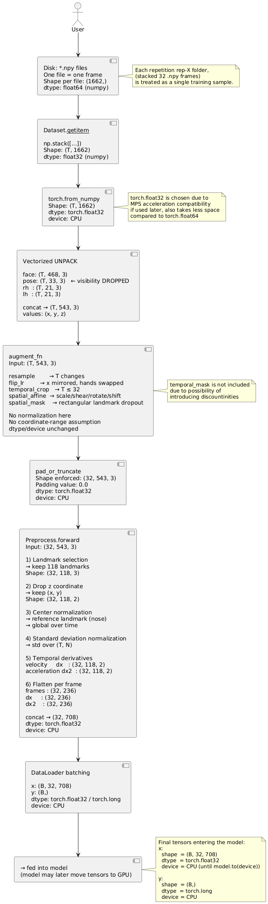
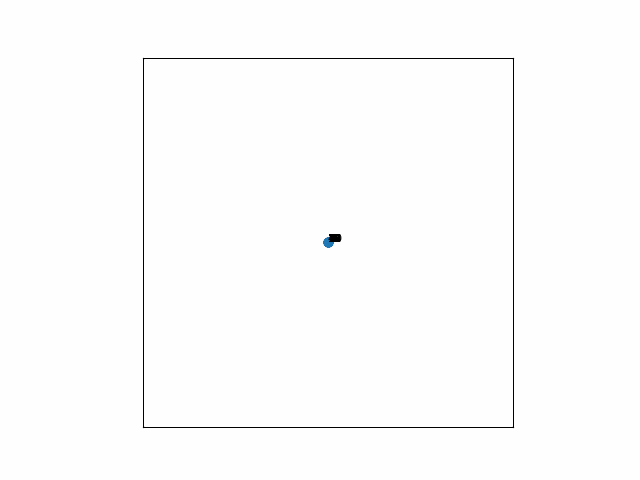
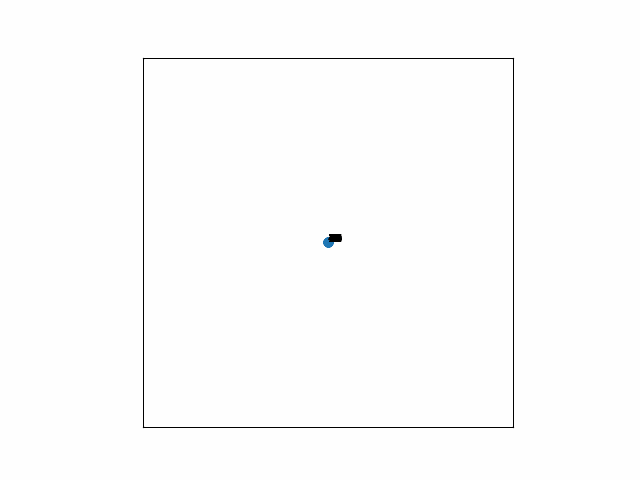
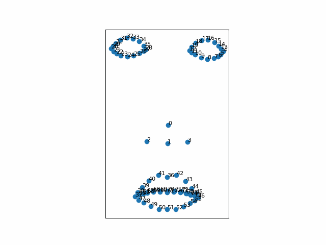
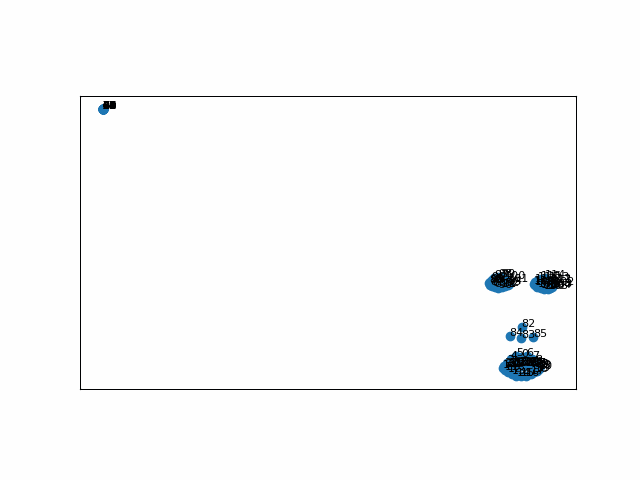
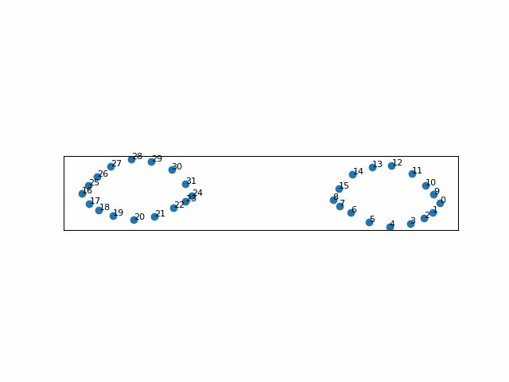
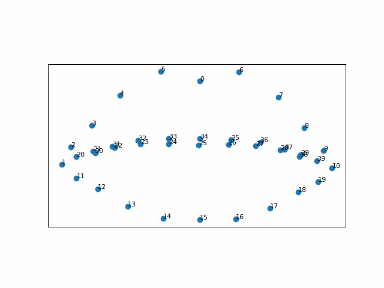
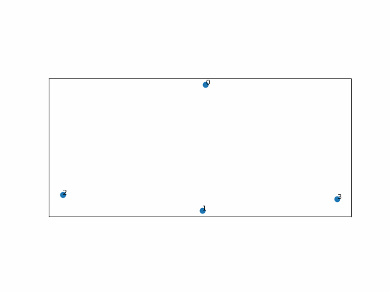

# Data Preprocessing Pipeline

> [!NOTE]
> This preprocessing pipeline is a **PyTorch adaptation** of the logical steps from Hoyso48 (2023) training notebook (author: Sohn, H., 2023).   
>
> The original notebook was written in TensorFlow and used a different dataset structure.  
> In this project, the pipeline is **not a direct copy** — it has been adapted for a **low-resource Uzbek Sign Language dataset** and PyTorch framework, with different folder organization and preprocessing steps suitable for this dataset.
>
> **Reference as to where this information was learned from, is provided below with relevant links.**

> [!IMPORTANT]
> **Workflow note:**  
> - Initial EDA was done in `01_ak_exploratory_analysis.ipynb`  
> - First preprocessing attempts were in `02_ak_preprocess_v1.ipynb`  
> - The current, final preprocessing and augmentation pipeline is in `02_ak_preprocess_v1.ipynb`  
> 
> **Naming convention (from Cookiecutter, n.d.):**  
> - `ak` = my initials  
> - `_vX` = version number, where higher means more refined improvements over the previous version (`_vX-1`)  
> - The leading numbers (`01`, `02`, etc.) indicate the **overall logical order** of the workflow steps

## Pipeline Stages

### Conda environment

```shell
# Create and activate the environment
conda env create -f environment-uzslr-signs.yml
conda activate uzslr-signs
```

> [!IMPORTANT]
> This environment, `uzslr-signs`, is currently configured to support all preprocessing steps.
> It will also be used for model training and evaluation once finalized.
> The [`environment-uzslr-signs.yml`](../environment-uzslr-signs.yml) will be expanded as new dependencies are added during the model development phase.


### Stage 1: Feature Selection

**Landmarks used:** Left and right hand, eye, nose, and lips landmarks (Sohn, 2023). Pose landmarks as per visualization analysis, did not provide useful information, that is why in this project pose landmarks are not considered.

> _Direct quote_: "I used left-right hand, eye, nose, and lips landmarks."  

Hence, for this project total of 118 landmarks out of 543 were chosen for this pipeline. 

> NOSE: 4
> LIP: 40
> REYE: 16
> LEYE: 16
> RHAND: 21
> LHAND: 21

<details>
<summary>
<b>To see the exact landmarks, click here:</b>
</summary>


This below given coordinates are taken from Sohn, H. (2023) training notebook, but have been modified to adapt to this project's dataset: https://www.kaggle.com/code/hoyso48/1st-place-solution-training?scriptVersionId=128283887&cellId=8


```python

NOSE=[
    1,2,98,327
]

LIP = [ 0, 
    61, 185, 40, 39, 37, 267, 269, 270, 409,
    291, 146, 91, 181, 84, 17, 314, 405, 321, 375,
    78, 191, 80, 81, 82, 13, 312, 311, 310, 415,
    95, 88, 178, 87, 14, 317, 402, 318, 324, 308,
]

REYE = [
    33, 7, 163, 144, 145, 153, 154, 155, 133,
    246, 161, 160, 159, 158, 157, 173,
]
LEYE = [
    263, 249, 390, 373, 374, 380, 381, 382, 362,
    466, 388, 387, 386, 385, 384, 398,
]

RHAND = list(range(468 + 33, 468 + 33 + 21))      # [501, 502, ..., 522] 
LHAND = list(range(468 + 33 + 21, 468 + 33 + 42)) # [522, 523, ..., 542]

POINT_LANDMARKS = LIP + LHAND + RHAND + NOSE + REYE + LEYE # 118 landmarks in total

```

</details>

---

### Stage 2: Preprocessing (`Preprocess` Class)
The `Preprocess` class handles feature selection, normalization, and temporal feature engineering for each sample. It converts raw frame data into a fixed, standardized representation suitable for the model.

- **Firstly:** Unpack raw frame(s) `(1662,)` -> `(543, 3)`  
- **Then:** Extract 118 selected landmarks (hands, lips, eyes, nose), keep only `x, y` -> `(T, 118, 2)`  
- **Next:** Center and normalize landmarks relative to reference point (17th landmark) -> `(T, 118, 2)`  
- **Then:** Compute temporal dynamics: velocity and acceleration -> `(T, 118, 2)` each  
- **Finally:** Flatten and concatenate position, velocity, acceleration -> `(T, 708)` (final features)

---

### Stage 3: Data Augmentation

- **Firstly:** Temporal resampling to simulate varying gesture speeds -> may **increase or decrease number of frames** `(T, 543, 3)`  
- **Then:** Horizontal flip (mirror) of hands, lips, eyes, and nose with landmark swapping -> `(T, 543, 3)`  
- **Next:** Random spatial transformations (affine) including **scaling, rotation, shear, and shifts** -> `(T, 543, 3)`  
- **Then:** Temporal crop to limit sequence length -> `(MAX_LEN, 543, 3)`  
- **Finally:** Random spatial masking applied to a rectangular region across all frames -> `(MAX_LEN, 543, 3)`  

> Each augmentation is applied **randomly** with a predefined probability to increase variability in the training data.


---


### Stage 4: Dataset Loading (`SignDataset`)

- **Firstly:** Scan dataset directories to collect all repetitions and assign **integer labels** based on sign names.  
  - Each sample is stored as a list of `.npy` frame paths + label
- **Then:** Load all frames for a sample into memory and **convert to PyTorch tensors** `(T, 1662)`
- **Next:** **Unpack flat vectors** into structured landmarks: face, pose, left hand, right hand -> `(T, 543, 3)`
- **Then (optional):** Apply **augmentations** (`augment_fn`) which may modify coordinates and number of frames
- **Next:** Apply **`pad_or_truncate`** to ensure a **fixed sequence length** `(MAX_LEN, 543, 3)`
- **Then:** Apply **preprocessing** (`Preprocess`) for **feature selection, centering, normalization, and temporal dynamics** -> `(MAX_LEN, 708)`
- **Finally:** Return the **processed feature tensor** `x` and **label tensor** `y` for model training

---

### Stage 5: DataLoader

- **Firstly:** Wrap the `SignDataset` with PyTorch `DataLoader` to create **batches** for training  
- **Then:** Each batch has shape `(B, T, 708)` where:  
  - `B` = batch size  
  - `T` = number of frames per sequence (`MAX_LEN`)  
  - `708` = features per frame (position + velocity + acceleration for 118 landmarks)  
- **Finally:** The batch tensor is of type `torch.float32` and resides on **CPU** by default. Labels are returned as `torch.long` with `0-49` range


---


## Pipeline Summary

Complete preprocessing pipeline follows this sequence:

<pre>

</pre>



---

## Visualizing Frames
<!-- 







 -->

<!-- Hands row -->
<table>
  <tr>
    <td align="center">
      <br>
      Right Hand
    </td>
    <td align="center">
      <br>
      Left Hand
    </td>
    <td align="center">
      <br>
      Both Hands
    </td>
  </tr>

  <!-- Face row -->
  <tr>
    <td align="center">
      <br>
      Face
    </td>
  </tr>

  <!-- Full body row -->
  <tr>
    <td align="center">
      <br>
      Full Body
    </td>
  </tr>

  <!-- Eyes, lips, nose row -->
  <tr>
    <td align="center">
      <br>
      Eyes
    </td>
    <td align="center">
      <br>
      Lips
    </td>
    <td align="center">
      <br>
      Nose
    </td>
  </tr>
</table>

---

**References List**
-

Bergeron, M. (2024). Insightful Datasets for ASL recognition. Hackster.io. Available at: https://www.hackster.io/AlbertaBeef/insightful-datasets-for-asl-recognition-f786b9 [Accessed: 28 December 2025]

Computer Vision Engineer. (2023). _Sign Language Detection with Python and Scikit Learn | Landmark Detection | Computer Vision Tutorial_. [Video] Available at: https://www.youtube.com/watch?v=MJCSjXepaAM&t=3148s [Accessed: 27 October 2025]

Cookiecutter (n.d.). _Using the template – Cookiecutter Data Science_. Available at: https://cookiecutter-data-science.drivendata.org/using-the-template/ (Accessed: 2 January 2026)

Goncharov, I. (2022). _Custom Hand Gesture Recognition with Hand Landmarks Using Google’s Mediapipe + OpenCV in Python_. [Video] Available at: https://www.youtube.com/watch?v=a99p_fAr6e4&list=PL0FM467k5KSyt5o3ro2fyQGt-6zRkHXRv [Accessed: 27 October 2025]

Hoyso48 (2023). _1st place solution ‑ training [Kaggle notebook]_. Available at: https://www.kaggle.com/code/hoyso48/1st-place-solution-training?scriptVersionId=128283887&cellId=8 (Accessed: 27 December 2025)

Renotte, N. (2021). _Sign Language Detection using ACTION RECOGNITION with Python | LSTM Deep Learning Model_. [Video] Available at: https://www.youtube.com/watch?v=doDUihpj6ro [Accessed: 21 October 2025]

Sohn, H. (2023). _1st place solution - 1DCNN combined with Transformer_. Available at: https://www.kaggle.com/competitions/asl-signs/writeups/hoyeol-sohn-1st-place-solution-1dcnn-combined-with [Accessed: 27 December 2025]


